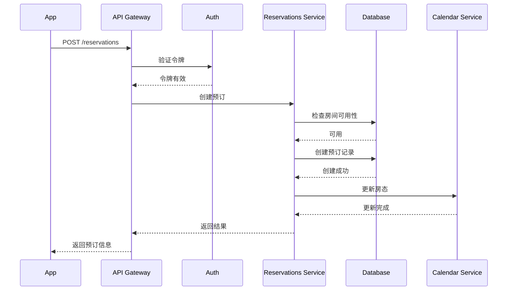
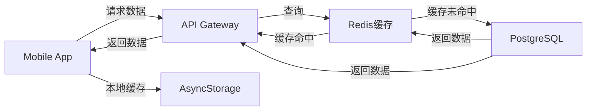

# RoomEase 系统架构文档

## 系统概览

RoomEase是一个现代化的酒店民宿管理系统，采用微服务架构和多端应用设计。

```
┌─────────────────────────────────────────────────────────┐
│                    RoomEase 系统架构                      │
├─────────────────────────────────────────────────────────┤
│                                                         │
│  ┌──────────┐  ┌──────────┐  ┌──────────┐             │
│  │ Web App  │  │Mobile App│  │ 小程序   │  前端层     │
│  │ (Next.js)│  │ (Expo)   │  │ (Taro)  │             │
│  └─────┬────┘  └─────┬────┘  └────┬────┘             │
│        │             │             │                   │
│        └─────────────┴─────────────┘                   │
│                      │                                  │
│        ┌─────────────▼────────────────┐                │
│        │   API Gateway (NestJS)       │  网关层       │
│        │  - 认证授权                   │                │
│        │  - 路由分发                   │                │
│        │  - GraphQL/REST              │                │
│        └─────────────┬────────────────┘                │
│                      │                                  │
│        ┌─────────────▼────────────────┐                │
│        │      业务服务层              │  服务层       │
│        │  ┌──────────────────────┐   │                │
│        │  │ 房间管理服务          │   │                │
│        │  │ 预订管理服务          │   │                │
│        │  │ 房态日历服务          │   │                │
│        │  │ 统计分析服务          │   │                │
│        │  │ 价格管理服务          │   │                │
│        │  └──────────────────────┘   │                │
│        └─────────────┬────────────────┘                │
│                      │                                  │
│        ┌─────────────▼────────────────┐                │
│        │     数据持久层                │  数据层       │
│        │  ┌──────────┐  ┌──────────┐ │                │
│        │  │PostgreSQL│  │  Redis   │ │                │
│        │  │  (主库)  │  │  (缓存)  │ │                │
│        │  └──────────┘  └──────────┘ │                │
│        └──────────────────────────────┘                │
│                                                         │
└─────────────────────────────────────────────────────────┘
```

## 技术栈

### 前端应用

#### Web应用 (Next.js)
- **框架**: Next.js 14
- **语言**: TypeScript
- **UI库**: React 18
- **样式**: TailwindCSS
- **状态管理**: React Query
- **图表**: Recharts

#### Mobile应用 (React Native)
- **框架**: Expo
- **语言**: TypeScript
- **导航**: Expo Router
- **状态管理**: Redux Toolkit
- **UI组件**: React Native Paper
- **本地存储**: AsyncStorage

#### 小程序 (Taro)
- **框架**: Taro 3
- **语言**: TypeScript
- **UI库**: Taro UI
- **状态管理**: Redux

### 后端服务

#### API网关
- **框架**: NestJS
- **语言**: TypeScript
- **数据库ORM**: Prisma
- **认证**: JWT + Passport
- **API文档**: Swagger/OpenAPI
- **GraphQL**: Apollo Server
- **WebSocket**: Socket.io

#### 数据库
- **主数据库**: PostgreSQL 14
- **缓存**: Redis 6
- **全文搜索**: (可选) Elasticsearch
- **消息队列**: (可选) Bull

### 基础设施

- **容器化**: Docker
- **编排**: Kubernetes (可选)
- **CI/CD**: GitHub Actions
- **监控**: Prometheus + Grafana
- **日志**: ELK Stack (可选)
- **文件存储**: S3 / 阿里云OSS

## 核心模块

### 1. 认证授权模块

**功能**:
- 用户登录/注册
- JWT令牌管理
- 多租户隔离
- 角色权限控制

**实现**:
```typescript
// JWT策略
@Injectable()
export class JwtStrategy extends PassportStrategy(Strategy) {
  async validate(payload: any) {
    return await this.authService.validateUser(payload.sub, payload.tenantId)
  }
}
```

### 2. 房间管理模块

**功能**:
- 房间CRUD
- 房型管理
- 房间状态
- 可用性查询

**数据模型**:
```prisma
model Room {
  id            String
  name          String
  code          String
  roomType      String
  basePrice     Decimal
  propertyId    String
  reservations  Reservation[]
}
```

### 3. 预订管理模块

**功能**:
- 预订创建/修改/取消
- 入住/退房
- 状态流转
- 冲突检测

**业务流程**:
```
创建预订 → 检查可用性 → 验证数据 → 创建记录 → 更新房态
```

### 4. 房态日历模块

**功能**:
- 日历视图
- 房态展示
- 关房管理
- 价格覆盖

**数据结构**:
```typescript
interface CalendarData {
  rooms: Room[]
  reservations: Reservation[]
  overrides: CalendarOverride[]
}
```

### 5. 统计分析模块

**功能**:
- 实时仪表板
- 入住率趋势
- 收入统计
- 渠道分析

**KPI指标**:
- 总房间数
- 入住率
- 平均房价 (ADR)
- 每间可售房收入 (RevPAR)

## 数据流

### 1. 创建预订流程



### 2. 数据同步流程



## 安全架构

### 认证机制

1. **JWT双令牌机制**
   - Access Token: 15分钟有效期
   - Refresh Token: 7天有效期
   - 自动刷新机制

2. **多租户隔离**
   - 租户ID验证
   - 数据行级隔离
   - 跨租户访问控制

### 数据安全

1. **敏感数据加密**
   - 身份证号加密存储
   - 密码bcrypt哈希
   - HTTPS传输

2. **访问控制**
   - RBAC角色权限
   - API速率限制
   - IP白名单（可选）

## 性能优化

### 1. 缓存策略

```typescript
// Redis缓存房间数据
async getRooms(propertyId: string) {
  const cacheKey = `rooms:${propertyId}`
  
  // 从缓存获取
  let rooms = await this.redis.get(cacheKey)
  
  if (!rooms) {
    // 从数据库查询
    rooms = await this.prisma.room.findMany({ where: { propertyId } })
    
    // 写入缓存，5分钟过期
    await this.redis.setex(cacheKey, 300, JSON.stringify(rooms))
  }
  
  return JSON.parse(rooms)
}
```

### 2. 数据库优化

- 索引优化
- 查询优化
- 连接池配置
- 读写分离（可选）

### 3. 前端优化

- 代码分割
- 懒加载
- 图片优化
- 服务端渲染 (SSR)

## 扩展性设计

### 1. 水平扩展

```yaml
# Kubernetes部署
apiVersion: apps/v1
kind: Deployment
metadata:
  name: roomease-api
spec:
  replicas: 3  # 3个副本
  selector:
    matchLabels:
      app: roomease-api
  template:
    metadata:
      labels:
        app: roomease-api
    spec:
      containers:
      - name: api
        image: roomease/api:latest
        ports:
        - containerPort: 4000
```

### 2. 服务拆分

当业务增长时，可以拆分为独立微服务：

```
API Gateway
├── Auth Service (独立服务)
├── Room Service (独立服务)
├── Reservation Service (独立服务)
├── Calendar Service (独立服务)
└── Analytics Service (独立服务)
```

### 3. 事件驱动

使用消息队列实现异步处理：

```typescript
// 发布预订创建事件
await this.eventBus.publish('reservation.created', {
  id: reservation.id,
  roomId: reservation.roomId,
  checkInDate: reservation.checkInDate,
})

// 订阅事件
@OnEvent('reservation.created')
async handleReservationCreated(payload: any) {
  // 更新房态
  await this.calendarService.updateRoomStatus(payload.roomId, payload.checkInDate)
  
  // 发送通知
  await this.notificationService.sendBookingConfirmation(payload.id)
}
```

## 监控和日志

### 1. 应用监控

- **健康检查**: `/health` 端点
- **性能指标**: Prometheus metrics
- **错误追踪**: Sentry
- **APM**: New Relic / DataDog

### 2. 日志系统

```typescript
// 结构化日志
this.logger.log({
  level: 'info',
  message: 'Reservation created',
  reservationId: reservation.id,
  userId: user.id,
  timestamp: new Date().toISOString(),
})
```

### 3. 告警规则

- API错误率 > 5%
- 响应时间 > 1s
- 数据库连接池满
- 内存使用 > 80%

## 部署架构

### 开发环境

```
本地开发机
├── PostgreSQL (Docker)
├── Redis (Docker)
├── API Gateway (localhost:4000)
├── Web App (localhost:3000)
└── Mobile App (Expo Go)
```

### 生产环境

```
Cloud Infrastructure
├── Load Balancer
├── API Servers (Auto Scaling)
│   ├── Server 1
│   ├── Server 2
│   └── Server 3
├── Database Cluster
│   ├── Primary
│   └── Replica
├── Redis Cluster
└── CDN (静态资源)
```

## 数据备份策略

1. **数据库备份**
   - 每日全量备份
   - 每小时增量备份
   - 保留30天

2. **灾难恢复**
   - RTO: 4小时
   - RPO: 1小时
   - 异地备份

## 开发规范

### 1. 代码规范

- ESLint + Prettier
- 命名规范: camelCase/PascalCase
- 注释规范: JSDoc
- Git提交规范: Conventional Commits

### 2. API设计规范

- RESTful风格
- 统一响应格式
- 错误码标准化
- 版本控制: `/api/v1`

### 3. 测试规范

- 单元测试覆盖率 > 80%
- 集成测试
- E2E测试
- 性能测试

## 未来规划

### 短期目标 (3个月)

- [ ] 完善权限系统
- [ ] 实现数据导入导出
- [ ] 添加更多报表
- [ ] 优化移动端性能

### 中期目标 (6个月)

- [ ] 渠道对接 (OTA)
- [ ] 智能定价
- [ ] 财务管理
- [ ] 会员系统

### 长期目标 (1年)

- [ ] AI预测分析
- [ ] 多语言支持
- [ ] 国际化扩展
- [ ] 开放平台API

## 技术债务

- [ ] 优化数据库查询性能
- [ ] 重构部分遗留代码
- [ ] 完善错误处理
- [ ] 增加测试覆盖率
- [ ] 更新依赖包

## 参考资源

- [API文档](./API_DOCUMENTATION.md)
- [部署指南](./DEPLOYMENT_GUIDE.md)
- [Mobile集成指南](./MOBILE_API_INTEGRATION.md)
- [Prisma文档](https://www.prisma.io/docs)
- [NestJS文档](https://docs.nestjs.com)
- [Expo文档](https://docs.expo.dev)

